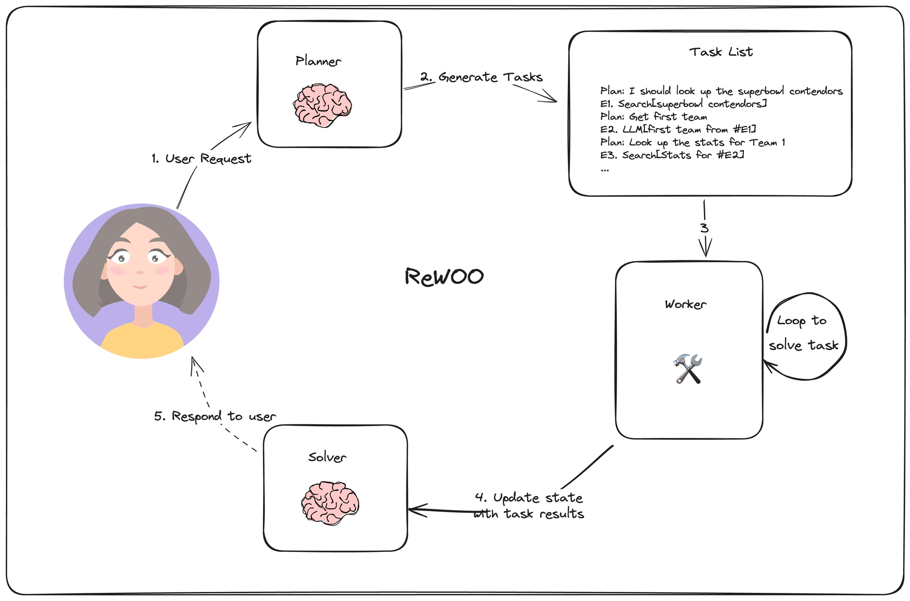

# Intelligent SQL Chat Agent with FastAPI
This project is an intelligent conversational agent powered by FastAPI, LangChain, and OpenAI's GPT-4o. It enables natural language interaction with SQL databases, maintains session-based chat history, and supports SQL generation using a Rewoo-style multi-step reasoning architecture.

The main goal of this project is to develop the backend for a text-to-SQL chatbot using generative language models.


## 🛢️Database

- This project uses the Bike Store Sample Relational Database from Kaggle:

🔗 [Kaggle Dataset – Bike Store Database](https://www.kaggle.com/datasets/dillonmyrick/bike-store-sample-database)

It is a normalized relational database designed for retail operations.


## 🛠️ Technologies Used

| Technology                   | Description                                                                                                                                                                      |
| ---------------------------- | -------------------------------------------------------------------------------------------------------------------------------------------------------------------------------- |
| **Python**                | The main programming language used for backend development and orchestration of all components.                                                                                  |
| **FastAPI**                | A modern, high-performance web framework for building APIs with Python 3.7+ based on standard Python type hints. Used to create REST endpoints and manage asynchronous requests. |
| **LangChain**             | A framework to build applications powered by language models. It’s used to integrate LLM-based reasoning, prompt engineering, and tool usage like SQL execution.                 |
| **PostgreSQL**           | The relational database used to store the Bike Store schema and manage chat history. Enables SQL execution and retrieval.                                                        |
| **JWT (JSON Web Tokens)** | Used for stateless user authentication. Provides secure access to the API via login tokens.                                                                                      |
| **Passlib**      | Secure password hashing to store user credentials safely in the database.                                                                                                        |
| **Pydantic**              | Used for data validation and serialization within FastAPI. Ensures input/output data follows strict schema definitions.                                                          |
| **YAML**                  | Used for external configuration of models and tools to support flexible experimentation and setup.                                                                               |


## 🧠 Text-to-SQL Generation architectures

- Few-Shot Mode: Direct SQL generation using few-shot prompting.

- Rewoo Mode: Multi-step reasoning with planning and execution for complex queries.


## 🧩 Rewoo Architecture

Rewoo (Reason Without Observation) is an LLM reasoning architecture that breaks down complex queries into three stages:

1. Planning – The LLM creates a high-level reasoning plan.

2. Working – Tools are used to execute steps of the plan (e.g., SQL generation, querying).

3. Solving – The outputs are aggregated and finalized into a coherent answer.

This allows for more accurate answers for complex multi-step questions.




📚 **Learn more about Rewoo:**
[Rewoo Documentation](https://langchain-ai.github.io/langgraph/tutorials/rewoo/rewoo/)


## 🚀 **Getting Started**

**Clone the repository**
```
git clone https://github.com/caruso44/Text_to_sql.git
cd sql-chat-agent
```

**Install dependencies**
```
pip install -r requirements.txt
```

**Run the FastAPI app**
```
uvicorn app.main:app --reload
```

**Access the API**
http://localhost:8000/docs

## 🧪 Coming Soon

- Web frontend with chat UI

- Logging and monitoring dashboard

